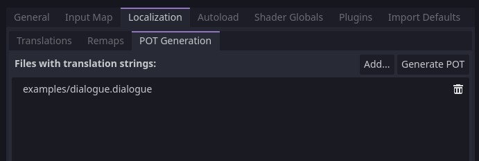

# Translations

By default, all dialogue and response prompts will be run through Godot's `tr` function to provide translations. 

You can turn this off by setting `DialogueManager.auto_translate = false` but beware, if it is off you may need to handle your own variable replacements if using manual translation keys. You can use `DialogueManager.get_resolved_text(dialogue_line.text, dialogue_line.text_replacements)` to replace text variable markers with their values.

This might be useful for cases where you have audio dialogue files that match up with lines.

## Generating POT files

All `.dialogue` files are automatically added to the POT Generation list in **Project Settings > Localization** for them to be included in the general PO template.

It is recommended that you use _static translation keys_ (line IDs) when tranlsating to make it easier on yourself and your translaters if/when line content changes.

## Static translation keys in dialogue

You can export translations as CSV from the "Translations" menu in the dialogue editor. 

This will find any unique dialogue lines or response prompts and add them to a list. If an ID is specified for the line (eg. `[ID:SOME_KEY]`) then that will be used as the translation key, otherwise the dialogue/prompt itself will be.

If the target CSV file already exists, it will be merged with.

## Importing changes to translations CSV

If you've made changes in the exported CSV to the original lines then you can reimport them from the translations menu.

This will match lines using static keys and replace the dialogue/response content with the text found in the CSV.